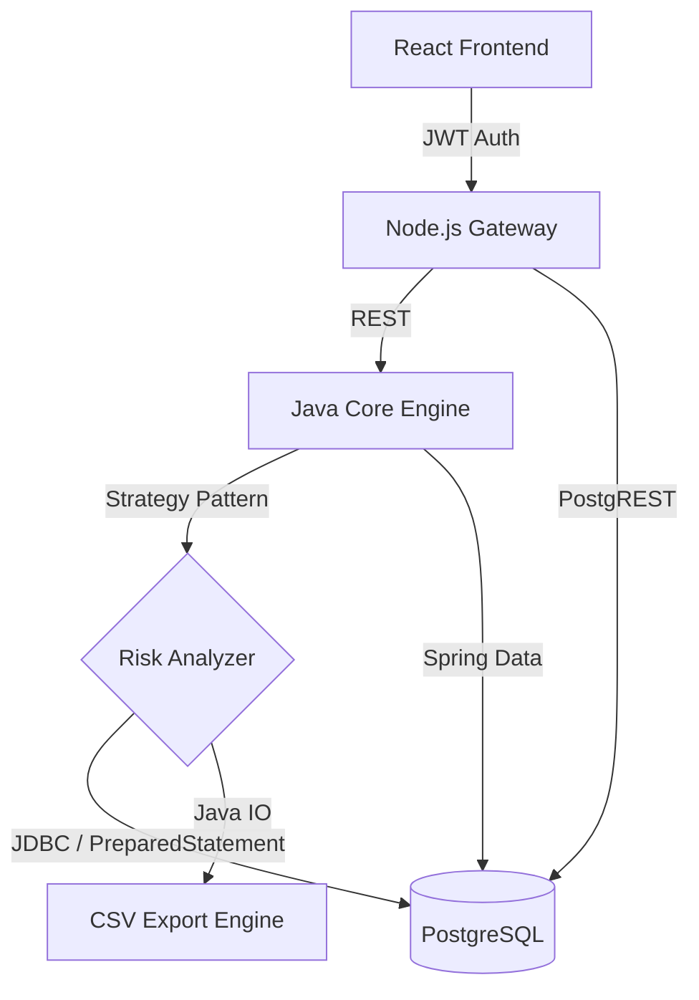

# 🔒 RiskMatrix — Credit Risk Analysis Platform

> A modular, production-ready fintech application for credit risk assessment, behavioral simulation, and automated financial reporting.


---

## 🏛️ System Architecture

RiskMatrix follows a **Decoupled Multi-Service** architecture designed for scalability and clear separation of concerns.



---

## ✨ Key Features

| Feature | Implementation | Rubric Item |
| :--- | :--- | :--- |
| **Strategy Pattern** | Pluggable `RiskStrategy` interface (WeightedAverage, etc.) | Software Design |
| **JDBC Persistence** | `JdbcRiskRepository` with audit logging | Database |
| **Data Export** | `DataExportService` generating CSV reports | File Handling |
| **Unit Testing** | JUnit 5 & Mockito test suite | Testing |
| **AI Diagnostics** | "Arya" AI agent for natural language risk explanations | Agentic Intelligence |
| **Security** | JWT authentication, BCrypt hashing, rate limiting, Helmet.js | Security |

---

## 🛠️ Technology Stack

| Layer | Technology | Purpose |
|-------|-----------|---------|
| **Frontend** | React 19, Framer Motion, Tailwind CSS | User Interface |
| **Gateway** | Node.js, Express.js | Security, rate limiting, proxying |
| **Core Engine** | Java Spring Boot | Risk calculation logic |
| **Database** | Supabase (PostgreSQL) | Data persistence |

---

## 🚀 Getting Started

### Prerequisites
- Node.js 18+
- JDK 17+
- Maven 3.9+
- PostgreSQL (managed via Supabase)

### Running the Application

| Module | Command | Port |
| :--- | :--- | :--- |
| **Frontend** | `cd frontend && npm run dev` | `5173` |
| **Backend** | `cd backend && npm run dev` | `3001` |
| **Java Engine** | `cd core-engine && mvn spring-boot:run` | `8080` |

---

## 🗄️ Database Schema (JDBC Logging)

The following table structure is required for direct JDBC audit functionality:

```sql
CREATE TABLE IF NOT EXISTS risk_logs (
    id SERIAL PRIMARY KEY,
    user_id VARCHAR(255),
    risk_score DECIMAL(5,2),
    decision VARCHAR(50),
    created_at TIMESTAMP DEFAULT CURRENT_TIMESTAMP
);
```

---

## 👥 Team & Contributions

*   **Divyansh Agarwal** — *Backend Architecture & Core Engineering*
*   **Harsh Sharma** — *Full-Stack Integration & UI Design*

---

*Every scroll is intentional. Every calculation is precise.*
